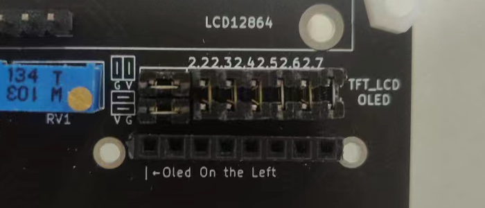

# MSP430F5529 LaunchPad扩展板
Master分支扩展板版本编号为V2.2，适用的案例工程为[MSP430F5529 LaunchPad 扩展板V2.1/V2.2案例工程](https://github.com/422lab/F5529_EXboard_Example)  
## 特性
* MSP430F5529 LaunchPad直插
* 多种显示屏支持
* LaunchPad全IO引出，标记编号以其复用功能
* 以上功能均可通过跳线帽和排线更改引脚
* 尽可能的硬件SPI支持
## 支持板载资源
* MSP430F5529 LaunchPad
* LCD12864
* 通用的4线I2C显示屏以及7/8线SPI显示屏
* ADS1118 / ADS1256(注意电源)
* DAC8571
* REF3330
* 4 * 4小键盘
## 注意事项
* 基于Kicad 5.1.12，向上Kicad6兼容，但是Kicad6不向下兼容，若后续有意使用Kicad6更新，最好创建一个新分支
* gerber文件请自行生成
* 可能会显示缺少符号库和封装库，已经放在仓库里了，自行重新导入一下  
## 实物图及使用说明
### 整体实物图(未插上模块和单片机)
焊接时注意哪些是排针哪些是排母，DIP插座可以由排母代替  
  
### 整体实物图(插上模块和单片机)
仅演示，实际上ADS1118和ADS1256不能同时使用，REF3330非必要模块
  
### 实物背面
  
### OLED/LCD显示屏  
一般市面上的OLED/LCD显示屏都是7线/8线接口，且通常前两个引脚的顺序为GND VCC(3V3)，所以此OLED/LCD显示屏接口可以兼容这些显示屏
  
当然也有一些脑回路新奇角度刁钻的店家推出了前两个引脚顺序为VCC GND的显示屏，所以进行了兼容，将前两个跳线帽横过来连接即可将前两个引脚顺序改为VCC GND
  
这个显示屏接口兼容但不限于以下几个显示屏  
SSD1306 SPI (样例源码支持)  
  
SSD1306 I2C  
  
SSD1351 (样例源码支持)  
  
GC9A01
  
### LCD12864
LCD12864支持两种接线模式，一种是4bit/8bit并行接口，另一种是SPI串行接口，根据PSB引脚的电平决定，PSB的电平可以由跳线帽更变，电位器用作改变LCD12864的对比度，不过需要在LCD12864自身短接一个焊点才能生效，所以非必要元件

### 矩阵键盘  

### DAC8571 
DAC8571在扩展底板上支持两个电压参考源，一个是3.3V，另一个是来自REF3330的3.0V，可以根据跳线帽更改

  
### ADS1256/ADS1118
扩展底板可以的外挂ADC模块有16位精度的ADS1118和24位精度的ADS1256，两者不可同时使用，其中请注意，ADS1256使用的5V供电，ADS1118使用3V3供电(芯片手册上说支持5V，但是我5V接一片烧一片就很迷)，可以通过跳线帽的进行更改  

另外相比于ADS1118，ADS1256多了DRDY和RST两个引脚，DRDY用于判忙，RST用于硬复位，所以可以将ADS1256的RST与单片机的RST通过改变跳线帽连接在一起共用一个硬件复位，关键时刻还是能省一个GPIO的

至此，扩展底板实物大致介绍完毕